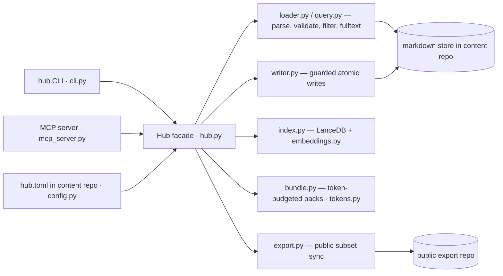

# Context

> Parent: [../AGENTS.md](../AGENTS.md)

## Snapshot
MemoryHub is a reusable, content-agnostic Python engine (3.11+, `src/` layout, Pydantic v2) over a markdown memory store: files with typed YAML frontmatter, validated against a schema profile (`src/memoryhub/profiles/personal.yaml` today — a new deployment is a new profile YAML, no engine changes). Consumers are content repos (`../personal-memory`; future `work-memory`) that carry their own `hub.toml` and depend on this package. The engine surfaces as the `hub` CLI (Typer), a FastMCP stdio server for agents, hybrid (vector + fulltext) search over a LanceDB index, token-budgeted context bundles, and a deterministic public-subset export.
- External systems of record: the content repo's markdown store · LanceDB vector index · embedding backends (sentence-transformers local / OpenAI-compatible API)

## Mental model

## Navigation
| Need | Open |
|---|---|
| Repo structure — where things live | [maps/repo-map.md](maps/repo-map.md) |
| Pick a knowledge topic (key flows live here) | [knowledge/README.md](knowledge/README.md) |
| Domain terms / memory-store vocabulary | [knowledge/domain/glossary.md](knowledge/domain/glossary.md) |
| Engine ↔ content-repo relations, extras → capabilities | [maps/dependency-map.md](maps/dependency-map.md) |
| Add or correct knowledge — governance | [RULES.md](RULES.md) |
| Project coding standards | [knowledge/coding-standards.md](knowledge/coding-standards.md) |
